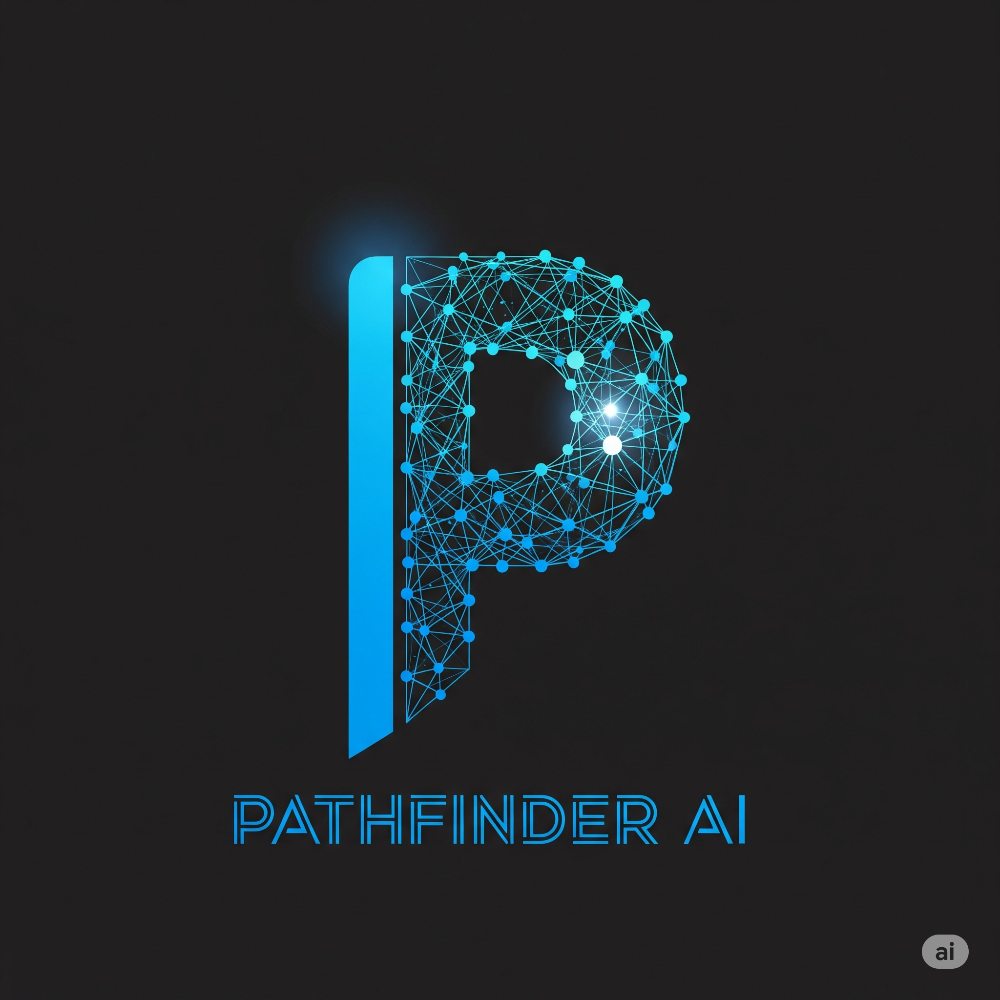

# 🎯 Pathfinder AI

<div align="center">



**Your Personalized Learning Journey, Powered by AI**

[](https://github.com/aadeshshukla/pathfinder-ai)
[](https://github.com/aadeshshukla/pathfinder-ai)
[](https://www.mongodb.com/)
[](https://reactjs.org/)
[](https://nodejs.org/)

[Live Demo](#) | [Report Bug](https://github.com/aadeshshukla/pathfinder-ai/issues) | [Request Feature](https://github.com/aadeshshukla/pathfinder-ai/issues)

</div>

---

## 📖 Table of Contents

- [About the Project](#about-the-project)
- [Features](#features)
- [Tech Stack](#tech-stack)
- [Getting Started](#getting-started)
  - [Prerequisites](#prerequisites)
  - [Installation](#installation)
  - [Environment Variables](#environment-variables)
- [Usage](#usage)
- [Project Structure](#project-structure)
- [API Documentation](#api-documentation)
- [Screenshots](#screenshots)
- [Roadmap](#roadmap)
- [Contributing](#contributing)
- [License](#license)
- [Contact](#contact)
- [Acknowledgments](#acknowledgments)

---

## 🌟 About The Project

**Pathfinder AI** is an intelligent learning roadmap generator that creates personalized, AI-powered learning paths tailored to your goals, skill level, and learning preferences. Whether you're a beginner starting your coding journey or an experienced developer exploring new technologies, Pathfinder AI provides structured, actionable roadmaps to guide your learning.

### Why Pathfinder AI?

- 🤖 **AI-Powered**:  Leverages Groq's LLaMA model to generate intelligent, context-aware learning paths
- 🎯 **Personalized**:  Customized roadmaps based on your goals, skill level, time commitment, and learning style
- 💾 **Save & Track**: Securely store all your roadmaps with user authentication
- 📱 **Responsive**: Fully optimized for desktop, tablet, and mobile devices
- 🎨 **Modern UI**: Beautiful dark-themed interface with smooth animations
- 🔐 **Secure**: JWT-based authentication with encrypted passwords

---

## ✨ Features

### 🎓 Core Features
- **AI Roadmap Generation**: Create personalized learning roadmaps using advanced AI
- **User Authentication**:  Secure registration and login with JWT tokens
- **Dashboard**: View all your saved roadmaps at a glance
- **My Roadmaps**:  Dedicated page to manage and organize your learning paths
- **Roadmap Details**: View comprehensive breakdown of each learning phase
- **User Profile**: Manage your account settings and preferences

### 🛠️ Technical Features
- **Real-time Generation**: Live roadmap creation with loading states
- **Search & Filter**: Find specific roadmaps quickly
- **Grid/List View**: Toggle between different viewing modes
- **Delete Roadmaps**: Remove unwanted learning paths
- **Toast Notifications**: User-friendly feedback for all actions
- **Confetti Celebrations**: Celebrate roadmap creation success
- **Responsive Design**:  Seamless experience across all devices
- **Protected Routes**: Secure pages requiring authentication

### 🎨 UI/UX Features
- Modern dark theme with gradient accents
- Smooth page transitions and animations
- Glass-morphism design elements
- Interactive cards with hover effects
- Progress indicators
- Empty states with helpful messages
- Mobile-optimized forms (no scrolling issues)
- Touch-friendly buttons (44px+ touch targets)

---

## 🛠️ Tech Stack

### Frontend
- **Framework**: [React 18](https://reactjs.org/) with [Vite](https://vitejs.dev/)
- **Routing**: [React Router v6](https://reactrouter.com/)
- **Animations**: [Framer Motion](https://www.framer.com/motion/)
- **Icons**: [React Icons](https://react-icons.github.io/react-icons/)
- **Notifications**: [React Toastify](https://fkhadra.github.io/react-toastify/)
- **Effects**: [React Confetti](https://www.npmjs.com/package/react-confetti)
- **Styling**: Custom CSS with modern features

### Backend
- **Runtime**: [Node.js](https://nodejs.org/)
- **Framework**: [Express.js](https://expressjs.com/)
- **Database**: [MongoDB](https://www.mongodb.com/) with [Mongoose](https://mongoosejs.com/)
- **Authentication**: [JWT](https://jwt.io/) (JSON Web Tokens)
- **Password Hashing**: [bcryptjs](https://www.npmjs.com/package/bcryptjs)
- **AI Integration**: [Groq SDK](https://groq.com/) (LLaMA 3.1)
- **Environment**: [dotenv](https://www.npmjs.com/package/dotenv)
- **Security**: [CORS](https://www.npmjs.com/package/cors), [Express Rate Limit](https://www.npmjs.com/package/express-rate-limit)

---

## 🚀 Getting Started

Follow these instructions to set up the project locally. 

### Prerequisites

Before you begin, ensure you have the following installed: 

- **Node.js** (v16 or higher)
  ```bash
  node --version